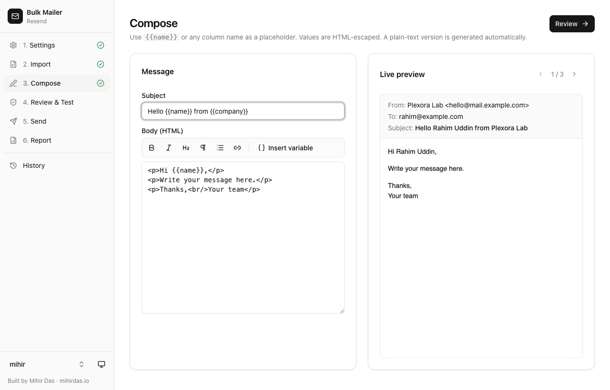
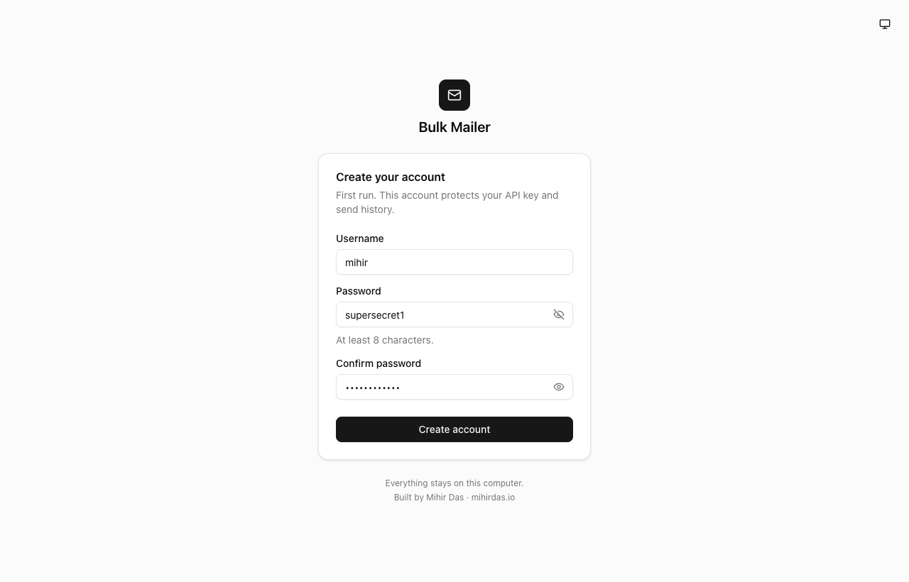
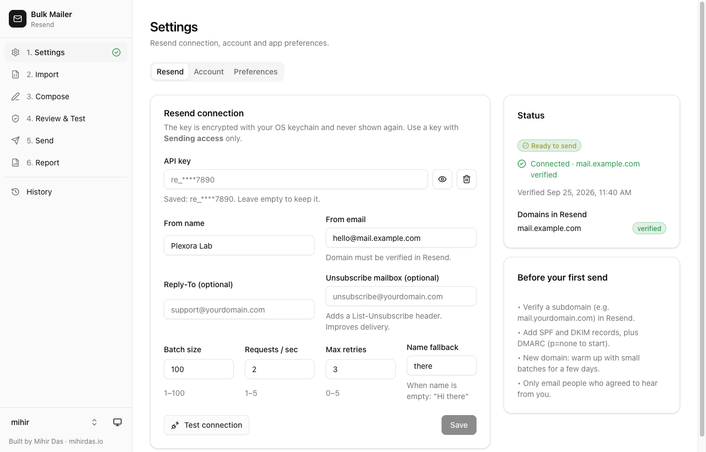
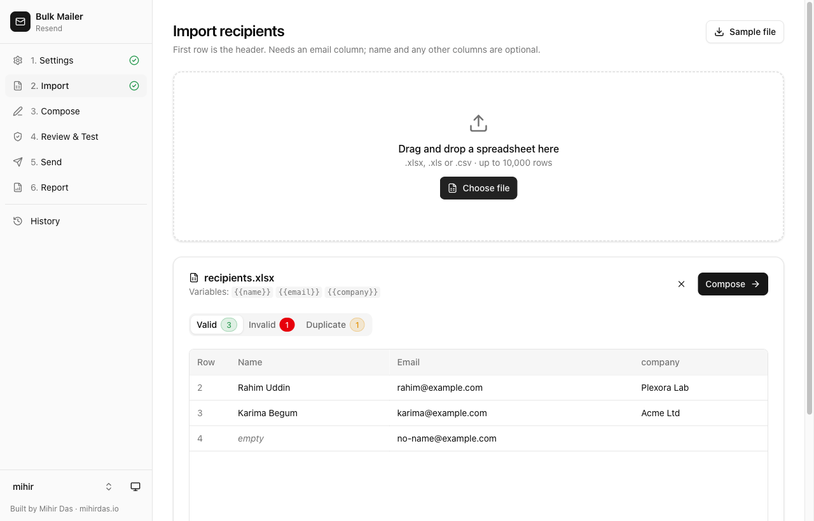
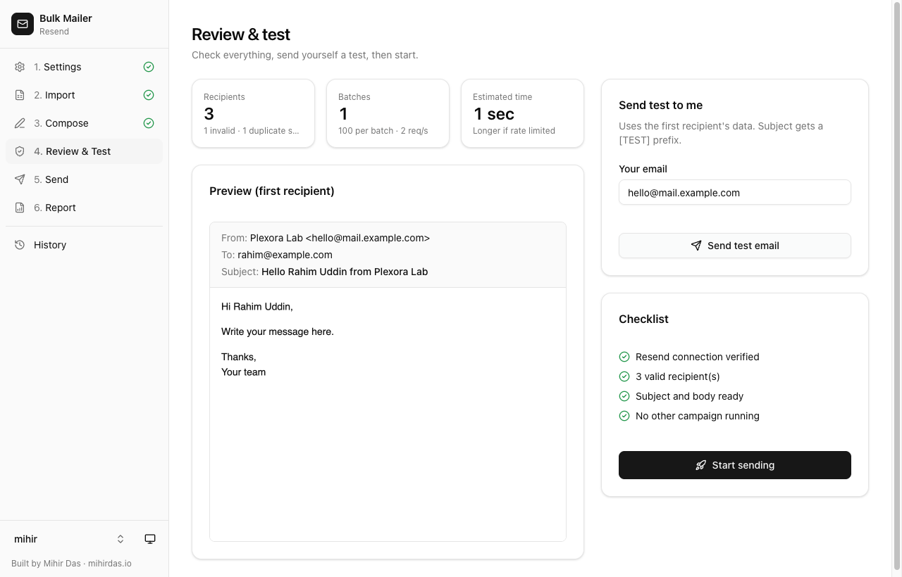
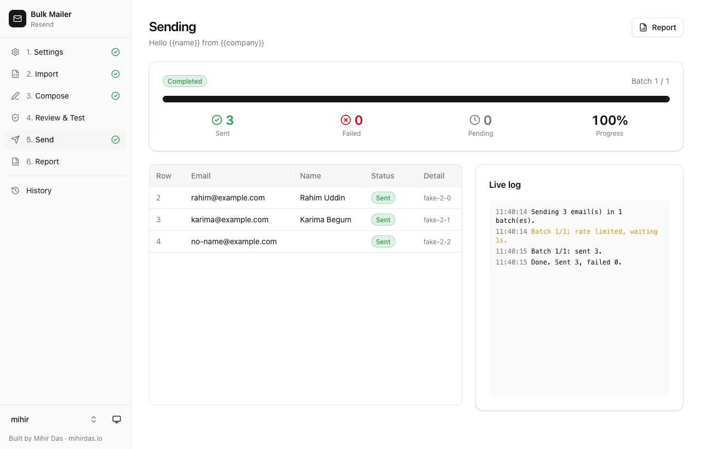
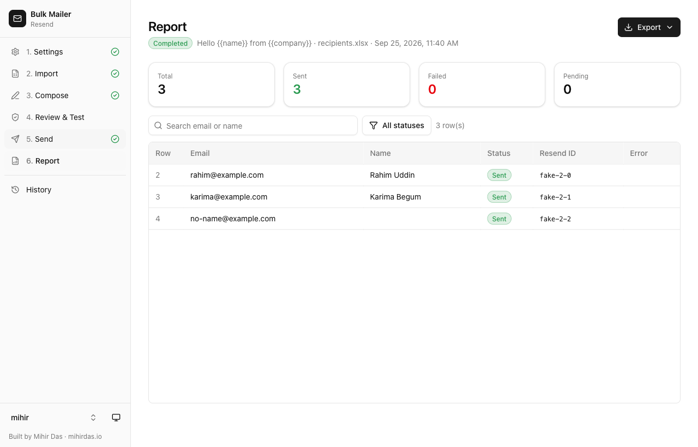
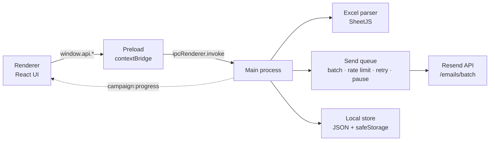

<div align="center">


# Bulk Mailer

**Send personalised bulk email from your desktop through [Resend](https://resend.com). Excel in, reports out.**

Runs locally on macOS and Windows. It has no server and no cloud database, and nothing leaves your computer except the emails you send.


[Download](#-download) · [Quick start](#-quick-start-for-users) · [Build from source](#-build-from-source) · [Troubleshooting](#-troubleshooting)



</div>

---

## Table of contents

- [Features](#-features)
- [Screenshots](#-screenshots)
- [Download](#-download)
- [Quick start (for users)](#-quick-start-for-users)
- [Preparing your spreadsheet](#-preparing-your-spreadsheet)
- [Build from source](#-build-from-source)
  - [Prerequisites](#prerequisites)
  - [macOS](#macos)
  - [Windows](#windows)
  - [Available scripts](#available-scripts)
- [Code signing and notarization](#-code-signing-and-notarization)
- [Architecture](#-architecture)
- [Security](#-security)
- [Where your data is stored](#-where-your-data-is-stored)
- [Troubleshooting](#-troubleshooting)
- [FAQ](#-faq)
- [Contributing](#-contributing)
- [License](#-license)
- [Author](#-author)

---

## ✨ Features

| | |
|---|---|
| 🔐 **Local login** | You create an account on first run. The password is hashed with bcrypt. After 5 failed attempts, login locks for 5 minutes. The app auto-locks when idle. |
| 🔑 **Resend setup in the app** | The API key is encrypted with the OS keychain and never shown again (`re_****abcd`). **Test connection** checks the key and your domain. |
| 📥 **Excel and CSV import** | Accepts `.xlsx`, `.xls` and `.csv` files with up to 10,000 rows. Name and email columns are detected automatically. Rows are sorted into **Valid**, **Invalid** and **Duplicate** tabs. |
| ✍️ **Personalisation** | Use `{{name}}`, `{{email}}` or **any column** in the subject and body, for example `{{company}}`. A live preview shows each recipient. |
| 🧪 **Test email** | Send a `[TEST]` copy to yourself before the real send. |
| 🚀 **Safe bulk sending** | Emails go out in batches of 100, rate-limited, with automatic retries and idempotency keys. A retry never sends a duplicate. |
| ⏯️ **Pause, resume and cancel** | You can stop at any point. If the app closes mid-send, resume later from History. |
| 📊 **Reports** | Per-recipient status with the Resend email ID. Export to CSV or XLSX, and retry only the failed recipients. |
| 🗂️ **History** | Every campaign is stored on your computer. |
| 🌗 **Light and dark themes** | Built with Tailwind CSS and shadcn/ui. |

---

## 📸 Screenshots

| Sign up | Resend settings |
|---|---|
|  |  |
| **Import** | **Review & test** |
|  |  |
| **Sending** | **Report** |
|  |  |

---

## 📦 Download

Get the latest installer from the [**Releases**](../../releases) page.

| Your computer | File to download |
|---|---|
| Mac (Apple Silicon M1–M4 **or** Intel) | `BulkMailer-x.y.z-mac-universal.dmg` |
| Windows 10/11, 64-bit (most PCs) | `BulkMailer-x.y.z-win-x64-setup.exe` |
| Windows on ARM (Surface Pro X, Snapdragon) | `BulkMailer-x.y.z-win-arm64-setup.exe` |

### Install on macOS

1. Open the `.dmg` file and drag **Bulk Mailer** into **Applications**.
2. Open Bulk Mailer from Launchpad or Spotlight.
3. **First launch only:** if macOS says it *"cannot verify"* the app, click **Done**. Then go to **System Settings → Privacy & Security**, scroll down, click **Open Anyway** and confirm. You won't be asked again.

> The warning appears because community builds are not notarized by Apple. See [Code signing](#-code-signing-and-notarization).

### Install on Windows

1. Run `BulkMailer-…-setup.exe`.
2. If **Windows protected your PC** appears, click **More info → Run anyway**.
3. Choose an install folder. A desktop and Start-menu shortcut are created.

> A portable `.zip` is also available. Unzip it and run `Bulk Mailer.exe`. No install is needed.

---

## 🚀 Quick start (for users)

### 1. Prepare Resend (one time, about 15 minutes)

1. Create an account at [resend.com](https://resend.com).
2. Go to **Domains → Add domain**. A subdomain such as `mail.yourdomain.com` protects the reputation of your main domain.
3. Add the **SPF**, **DKIM** and **MX** records that Resend shows to your DNS provider. Also add a **DMARC** TXT record:
   ```
   Name:  _dmarc.mail.yourdomain.com
   Value: v=DMARC1; p=none;
   ```
4. Wait until the domain status shows **Verified**. This takes minutes to a few hours.
5. Go to **API Keys → Create API key**. Choose **Sending access** and pick your domain. Copy the key (`re_…`).

> **Check your plan's limits** under **Settings → Usage** in Resend. The free plan has a daily sending quota. If you reach it, Bulk Mailer pauses the campaign, and you can resume it after the quota resets at midnight UTC.

### 2. Use the app

| Step | What to do |
|---|---|
| **1. Create account** | First launch. Choose a username and a password of at least 8 characters. Click the 👁 icon to see what you typed. |
| **2. Settings** | Paste the API key, then enter From name, From email and an optional Reply-To. Click **Save**, then **Test connection**. The badge should turn **Ready to send**. |
| **3. Import** | Drop your `.xlsx` or `.csv` file. Check the **Invalid** and **Duplicate** tabs. |
| **4. Compose** | Write the subject and HTML body. Insert variables such as `{{name}}` and check the live preview. |
| **5. Review & test** | Send a test to yourself and check your inbox and spam folder. Then click **Start sending** and confirm. |
| **6. Send** | Watch live progress. You can **Pause**, **Resume** or **Cancel** at any time. |
| **7. Report** | Export to CSV or Excel. Click **Retry unsent** if any emails failed. |

> ⚠️ **Only email people who agreed to hear from you.** Sending to bought or scraped lists gets domains blocklisted and Resend accounts suspended. With a new domain, start with small batches for a few days.

---

## 📄 Preparing your spreadsheet

The **first row must be a header**. An `email` column is required. `name` and any other columns are optional, and each column becomes a `{{variable}}`.

```csv
name,email,company
Rahim Uddin,rahim@example.com,Plexora Lab
Karima Begum,karima@example.com,Acme Ltd
```

- Header names are case- and space-insensitive: `Email`, `E-mail` and `Email Address` all work. A header such as `Company Name` becomes `{{company_name}}`.
- If no email column is found, the app asks you to map the columns.
- Emails are trimmed and lower-cased. Rows with invalid emails are skipped, and only the first copy of a duplicate is kept.
- If the name is empty, the **Name fallback** from Settings is used (default `there`, as in *"Hi there"*).
- Only the first sheet is read, up to 10,000 rows.
- A sample file is at [`sample/recipients.xlsx`](sample/recipients.xlsx), and **Import → Sample file** saves one too.

**Safe practice run.** Resend provides test inboxes that accept mail without affecting your reputation: `delivered@resend.dev`, `bounced@resend.dev` and `complained@resend.dev`. Adding a label such as `delivered+1@resend.dev` or `delivered+2@resend.dev` creates many unique test recipients.

---

## 🛠 Build from source

### Prerequisites

| Tool | Version | Download |
|---|---|---|
| **Node.js** | 22.12 or newer (LTS recommended) | [nodejs.org](https://nodejs.org) |
| **Git** | any recent version | [git-scm.com](https://git-scm.com) |

No Python, Xcode, Visual Studio or other native toolchain is needed. The project has no native modules.

Check your versions:

```bash
node -v   # v22.12.0 or higher
npm -v
git --version
```

### macOS

```bash
# 1. Get the code
git clone https://github.com/the-mihir/bulk-mailer.git
cd bulk-mailer

# 2. Install dependencies (downloads Electron, about 100 MB)
npm install

# 3. Run in development mode (hot reload)
npm run dev

# 4. Build the installer
npm run dist:mac
```

The installer is written to `dist/`:

```
dist/BulkMailer-1.0.0-mac-universal.dmg   ← share this
dist/BulkMailer-1.0.0-mac-universal.zip
dist/mac-universal/Bulk Mailer.app        ← or run this directly
```

To install your own build, open the `.dmg` and drag the app to **Applications**. Builds made on your own Mac open without a Gatekeeper warning.

### Windows

Use **PowerShell** or **Command Prompt**:

```powershell
# 1. Get the code
git clone https://github.com/the-mihir/bulk-mailer.git
cd bulk-mailer

# 2. Install dependencies
npm install

# 3. Run in development mode
npm run dev

# 4. Build the installer
npm run dist:win
```

The installers are written to `dist\`:

```
dist\BulkMailer-1.0.0-win-x64-setup.exe     ← share this (64-bit PCs)
dist\BulkMailer-1.0.0-win-arm64-setup.exe   ← Windows on ARM
dist\BulkMailer-1.0.0-win-x64.zip           ← portable, no install
```

> **PowerShell error "running scripts is disabled"?** Run `Set-ExecutionPolicy -Scope CurrentUser RemoteSigned` once, or use Command Prompt (`cmd`) instead.

### Building Windows installers on a Mac

This is optional. electron-builder's NSIS compiler is an Intel binary, so an Apple Silicon Mac needs Rosetta:

```bash
softwareupdate --install-rosetta --agree-to-license
npm run dist:win
```

Without Rosetta, `npx electron-builder --win zip --config electron-builder.config.cjs` still produces the portable Windows `.zip`.

### Build both with GitHub Actions

[`.github/workflows/release.yml`](.github/workflows/release.yml) builds the macOS and Windows installers on native runners, and runs the tests first. It runs when you push a version tag:

```bash
npm version patch          # e.g. 1.0.0 → 1.0.1, creates tag v1.0.1
git push --follow-tags
```

Download the installers from the workflow run's **Artifacts**, then attach them to a GitHub Release.

### Available scripts

| Command | What it does |
|---|---|
| `npm run dev` | Starts the app with hot reload |
| `npm run build` | Type-checks, then bundles main, preload and renderer into `out/` |
| `npm run preview` | Runs the production bundle without packaging |
| `npm test` | Unit tests for the template engine, Excel parser and send queue (Vitest) |
| `npm run test:e2e` | Clicks through the whole app against a fake Resend API (Playwright) |
| `npm run typecheck` | TypeScript checks for all processes |
| `npm run dist:mac` | Builds the universal macOS `.dmg` and `.zip` |
| `npm run dist:win` | Builds the Windows NSIS installers and `.zip` (x64 and arm64) |
| `npm run dist` | Builds both |
| `npm run icon` | Regenerates the app icon from code |

---

## 🔏 Code signing and notarization

Signing is configured in [`electron-builder.config.cjs`](electron-builder.config.cjs) and switches on automatically when these environment variables are set:

| Goal | Environment variables | Result |
|---|---|---|
| Default | *(none)* | Ad-hoc signed. It runs everywhere, but users approve it once. |
| macOS Developer ID | `CSC_NAME="Developer ID Application: Name (TEAMID)"` **or** `CSC_LINK` + `CSC_KEY_PASSWORD` (.p12) | Signed |
| macOS notarized | the Developer ID variables above **plus** `APPLE_ID`, `APPLE_APP_SPECIFIC_PASSWORD`, `APPLE_TEAM_ID` | Opens with **no warning** |
| Windows | `CSC_LINK` + `CSC_KEY_PASSWORD` (code-signing .pfx) | No SmartScreen warning once reputation builds |

macOS signing requires the [Apple Developer Program](https://developer.apple.com/programs/), which costs $99/year. Create the app-specific password at [appleid.apple.com](https://appleid.apple.com). For CI, add the same variables as **repository secrets**.

---

## 🏗 Architecture

Built with **Electron 44 · electron-vite · React 19 · TypeScript · Tailwind CSS v4 · shadcn/ui · Zustand · react-hook-form · Zod · SheetJS**.



All work that touches the file system, the network or the API key runs in the **main process**. The renderer only draws the UI and reaches main through a small typed API.

```
src/
├── main/                  Electron main process
│   ├── index.ts           window, menu, app lifecycle
│   ├── security.ts        navigation lock, trusted-sender check
│   ├── ipc/               IPC handlers (auth, resend, excel, campaign)
│   ├── middleware/        requireAuth: login + Zod validation for every handler
│   ├── services/          auth, excel, resend, queue, campaign, report
│   └── store/             JSON stores, encrypted settings, campaign files
├── preload/               contextBridge → window.api (typed)
├── renderer/              React app
│   ├── pages/             Login, Settings, Import, Compose, Review, Send, Report, History
│   ├── components/        ui/ (shadcn), layout/, auth/, common/
│   ├── store/             Zustand stores
│   └── styles/            Tailwind + theme tokens
└── shared/                code used by both processes
    ├── ipc.ts             channel names + API contract
    ├── schemas.ts         Zod schemas
    ├── types.ts
    └── template.ts        {{placeholder}} rendering, HTML escaping, plain-text version
tests/                     Vitest unit tests + Playwright E2E (tests/e2e/smoke.mjs)
```

### How sending works

1. Valid recipients are split into chunks of **Batch size** (default 100).
2. Each chunk is one `POST /emails/batch` request with `Idempotency-Key: <campaignId>-<batchIndex>`.
3. Requests are spaced to at most **Requests/sec** (default 2, below Resend's default limit of 5).
4. Errors are handled by type:
   - **429 rate limit:** wait for `retry-after`, then retry.
   - **5xx or network error:** exponential backoff, up to **Max retries** attempts.
   - **Quota exceeded:** pause and notify you.
   - **401/403:** stop and tell you to fix Settings.
5. Progress is saved to disk after every batch, so the campaign can resume after a crash or quit.

---

## 🔒 Security

- `contextIsolation`, `sandbox` and `nodeIntegration: false` are set. DevTools are off in packaged builds.
- Only the app's own window can call IPC. Every channel except `auth:*` requires a login, and every input is validated with **Zod**.
- The API key is encrypted with `safeStorage` (macOS Keychain or Windows DPAPI). Only the main process decrypts it, and the UI never receives it.
- Passwords are stored as bcrypt hashes. There is no default password. The lockout persists across restarts.
- The app has a strict Content-Security-Policy. The email preview renders in a permission-less `<iframe sandbox>`.
- Spreadsheet values are HTML-escaped when inserted into the email body. Line breaks are removed from subjects, so data cannot inject email headers.
- The app cannot navigate away or open new windows. External links open in your browser.

**Found a vulnerability?** Please report it privately via [mihirdas.io](https://mihirdas.io) instead of opening a public issue.

---

## 💾 Where your data is stored

| OS | Folder |
|---|---|
| macOS | `~/Library/Application Support/Bulk Mailer/` |
| Windows | `%APPDATA%\Bulk Mailer\` |

| File | Contents |
|---|---|
| `user.json` | Username, password hash, lockout state |
| `settings.json` | Resend settings, with the API key encrypted |
| `campaigns/*.json` | Campaign history, per-recipient results, resume state |

Uninstalling keeps this folder. To erase everything, use **Settings → Account → Reset app**, or delete the folder.

---

## 🩺 Troubleshooting

<details>
<summary><b>macOS: "Bulk Mailer cannot be opened because Apple cannot check it" / "is damaged"</b></summary>

The app isn't notarized. Go to **System Settings → Privacy & Security → Open Anyway**. If macOS says the app is *damaged*, remove the download quarantine flag:

```bash
xattr -dr com.apple.quarantine "/Applications/Bulk Mailer.app"
```
</details>

<details>
<summary><b>Windows: "Windows protected your PC"</b></summary>

Click **More info → Run anyway**. This appears for unsigned apps.
</details>

<details>
<summary><b>Test connection: "domain is not verified" / "not added in Resend"</b></summary>

The domain of your **From email** must match a domain in Resend with status **Verified**. Check the DNS records in the Resend dashboard, then wait and retry.
</details>

<details>
<summary><b>Test connection shows "sending access only"</b></summary>

This is normal for restricted keys, which cannot list domains. Go to **Review & Test** and send a test email to yourself. When it succeeds, sending is enabled.
</details>

<details>
<summary><b>Campaign paused: "Daily sending quota reached"</b></summary>

Your Resend plan's daily limit was reached. Resume from **Send** or **History** after midnight UTC, or upgrade the plan. Already-sent recipients are never sent again.
</details>

<details>
<summary><b>Emails land in spam</b></summary>

- Make sure SPF, DKIM and DMARC all pass. In Gmail, open the message → ⋮ → *Show original*.
- Send from a subdomain, and warm up new domains slowly.
- Fill in **Unsubscribe mailbox** in Settings, which adds a `List-Unsubscribe` header.
- Keep the content personal, with few links and no URL shorteners.
</details>

<details>
<summary><b>Forgot the app password</b></summary>

On the login screen, click **Forgot password? → Erase everything**. This deletes the account, the stored API key and the history. Then set up the app again.
</details>

<details>
<summary><b><code>npm install</code> fails or Electron doesn't download</b></summary>

- Use Node 22.12 or newer (`node -v`).
- If you're behind a proxy or firewall, set `ELECTRON_MIRROR=https://npmmirror.com/mirrors/electron/` and run the install again.
- Delete `node_modules` and `package-lock.json`, then run `npm install` again.
- With npm 11, if install scripts are blocked, run `npm install-scripts approve electron esbuild`.
</details>

---

## ❓ FAQ

**Does it need a server or database?**
No. Everything runs and is stored on your computer.

**How fast is it?**
With the defaults (100 per batch, 2 requests/s), 1,000 emails take about 5–10 seconds. Your Resend plan's limits matter more than the app.

**Can I send attachments?**
Not currently. The Resend batch API doesn't support attachments.

**Is there a recipient limit?**
Each import can have up to 10,000 rows, and one campaign runs at a time.

**Can I use a different email provider?**
The app is built for Resend. Sending is isolated in `src/main/services/resend.service.ts` if you want to adapt it.

---

## 🤝 Contributing

Issues and pull requests are welcome.

1. Fork the repo and create a branch: `git checkout -b feature/my-change`.
2. Make your change and run `npm run typecheck && npm test && npm run test:e2e`.
3. Commit with a clear message and open a pull request.

Please keep the security model intact: no Node in the renderer, and validate every new IPC channel with Zod.

---

## 📜 License

[MIT](LICENSE) © 2026 Mihir Das

---

## 👤 Author

**Mihir Das**: [mihirdas.io](https://mihirdas.io)

If this project helps you, consider giving it a ⭐ on GitHub.
